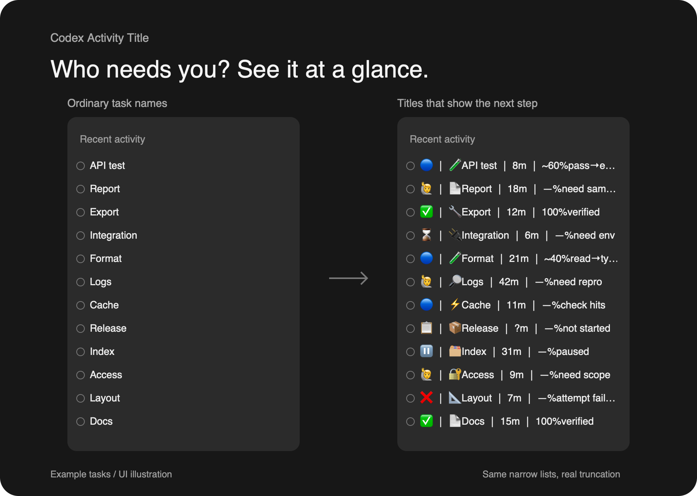
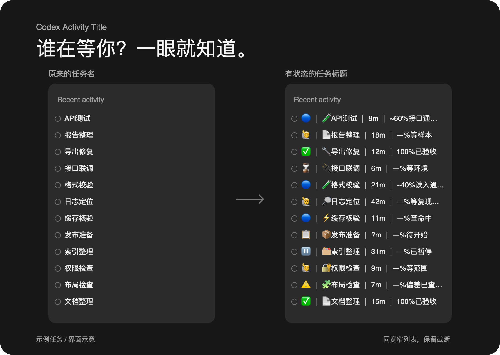

# Codex Activity Title · 0.1

**Too many tasks open? See which one is moving, waiting, or actually done.**

A small Codex Skill that turns an Activity title into a compact status line:

```text
status │ project icon + task │ elapsed │ progress + result → current action
```

| Before: a task name | After: a useful status line |
| --- | --- |
| Prepare report | 🔵 │ 📄Report │ 18m │ ~60%outline done→cite |
| Check feature | 🙋 │ 🧪Check │ 42m │ —%need sample |
| Fix export | ✅ │ 🔧Export │ 12m │ 100%verified |

These are invented examples. Percentages are estimates from task milestones; a title is not a live timer.

**Can an ordinary session use it? Yes. Actual renaming depends on its official tools.**

| Session / request | Supported behavior |
| --- | --- |
| Ordinary Codex task with official title read + write tools | Can update its own title; verified in one configured ordinary task |
| Dot/manager session, or a request to update other tasks | Requires official target access and explicit authorization for those tasks; this release does not claim cross-task verification |
| CLI or other sessions without the required official tools | Generates suggested titles only |

Dot is not required to update your own task when the official tools are present. Installing this Skill does not add tools or expand permissions.



**Example tasks / UI illustration, not a screenshot.** Both lists are 300 logical pixels wide, enlarged together for clarity; the right side can truncate. All 12 tasks match one-to-one. No private activity is included.

Useful when you switch between several Codex tasks and want to identify the next useful step without opening each conversation.

## Install and use

In Codex, ask:

```text
Use skill-installer to install activity-title from
https://github.com/dxxbb/codex-activity-title/tree/main/codex-skill/activity-title
```

Or copy the complete [`codex-skill/activity-title/`](codex-skill/activity-title/) folder into the skills directory your Codex setup uses. The standard local installer defaults to `~/.codex/skills/activity-title/`.

To pin an install, replace `COMMIT_SHA` with a verified revision:

```text
Use skill-installer to install activity-title from
https://github.com/dxxbb/codex-activity-title/tree/COMMIT_SHA/codex-skill/activity-title
```

The helper refuses to overwrite an existing install. For an upgrade, preserve any local edits, then replace the complete installed Skill folder with the chosen new revision. Edit the source package, not an installed copy, when maintaining your own fork.

Then ask:

```text
Use $activity-title for this task. Keep its title current when the task state changes.
```

For a preview without changing a title:

```text
Use $activity-title to suggest a title only.
```

Follow your runtime's skill reload guidance; installation alone does not prove that the current conversation has loaded it. Installing a local Codex Skill does not install it into ChatGPT or another agent runtime.

## What the title tells you

| Status | Meaning |
| --- | --- |
| 📋 | Not started |
| 🔵 | In progress |
| ⌛ | Waiting for a dependency or resource |
| 🙋 | Waiting for the user |
| ⏸️ | Deliberately paused |
| ✅ | Delivered within this task's acceptance scope |
| ❌ | This attempt failed |
| 🚫 | Explicitly cancelled |

Elapsed time covers the named task from its first trustworthy start, including waits. It freezes when that task ends. Unknown time is `?m`; unknown progress is `—%`. Estimated progress has a `~`; `100%` requires acceptance of the specific deliverable. An idle runtime does not mean a task is delivered.

The Skill follows the user's language, keeps task identity stable, and shortens result/action phrases before the task name. It uses the default proportional font with no padding or font installation. English words and emoji stay intact.

## Limits

- Official title tools must be available for updates. The Skill reads the target, skips an identical title, writes through the official rename tool, then reads it back. Without the tools, it gives a suggested title.
- Updates happen when the agent handles a task event. There is no background watcher, live clock, native dashboard, or fixed-width layout.
- A narrow Activity list may still truncate the right side. This is a plain text title, not four separately styled columns.
- Missing status evidence is reported outside the title; the Skill does not guess a status or equate a failed experiment with a failed project.

The public Skill folder is the maintained source. Installed copies are projections of a chosen revision. No personal task history is included.

## Checks

A default-current-target rename followed by a matching official readback was verified in an ordinary Codex task with the app tools exposed. This establishes support in that configuration, not in every Codex build or CLI. Other-target permissions and visual width are separate checks.

The self-contained [acceptance cases](codex-skill/activity-title/references/acceptance-cases.md) cover task-wide elapsed time, terminal-state freezing, failure/recovery, unknown data, milestone progress, Chinese/English width, idempotent updates, and unavailable or mismatching tool responses. They are synthetic behavioral checks, not a promise of automatic UI or background testing.

## 中文

**任务开多了，哪项在推进、哪项在等人、哪项真的完成？**



**示例任务 / 界面示意，不是截图。** 两列同为300逻辑像素，整体放大便于查看，12项任务一一对应；右侧保留截断，没有单独撑宽列表。

这个小 Skill 把 Codex Activity 标题变成四区状态栏：

```text
状态 │ 项目图标短任务 │ 耗时 │ 估算%已达成→当前动作
🔵 │ 📄报告整理 │ 18m │ ~60%提纲已定→补引用
🙋 │ 🧪功能验证 │ 42m │ —%等待样本
✅ │ 🔧导出修复 │ 12m │ 100%验收通过
```

英文 Skill 正文是执行规范，输出优先遵循用户明确指定的语言，否则沿用当前任务的交流语言；英文安装代码块不会把标题强制改成英文。可用中文安装：“用 skill-installer 从本仓库的 codex-skill/activity-title 安装 activity-title”；使用：“用 $activity-title，在任务状态变化时更新当前标题”。

以上都是合成示例。普通 Session 有官方标题读写工具时可改自己的标题，不要求 dot；改其他任务还需要目标访问能力和明确授权。CLI 等环境若缺少这些官方工具，只生成建议，安装 Skill 不会增加权限。安装后说“用 $activity-title，在任务状态变化时更新当前标题”；只想看候选标题，就说“只建议标题，不修改”。官方改名工具不可用时只提供建议。

耗时对应标题这项工作的首次开始到业务结束，包含等待，结束后冻结。未知写 `?m` / `—%`，进度估算带 `~`，具体交付通过验收才显示 `100%`。它按事件更新，不是后台实时计时器；默认比例字体，窄列表仍可能省略右侧文字。

MIT licensed. Independent community project; not affiliated with OpenAI.
